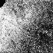
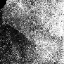
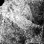

# varKoder

A tool that uses **var**iation in **K**-mer frequecies as DNA barc**ode**s.

This python program can generate varKodes from raw reads, which are images encoding the relative frequecies of different k-mers in a genome. It can also train a convolutional neural network to recognize species based on these images, and query new samples using a trained model.

For more information see the preprint:

de Medeiros, B.A.S, Cai, L., Flynn, P.J., Yan, Y., Duan, X., Marinho, L.C., Anderson, C., and Davis, C.C. (2024). **A universal DNA barcode for the Tree of Life**. *EcoEvoRxiv*. https://doi.org/10.32942/X24891

## Approach

With *varKoder*, we use very low coverage whole genome sequencing to produce images that represent the genome composition of a sample. These images look like this, for example:
| Beetle | Bacteria | Mushroom |
| ----- |  ----- | ----- |
|  |  |    |  

We then use well-established image classification models to train a neural network using these images so it can learn to associate *varKodes* with labels associated with them. Often, these labels will be the known taxonomic identification of a sample, such as its species or genus. However, our approach is very general and the labels could include any other features of interest.

Finally, you can use *varKoder* to predict labels for an unknown sample, starting from sequencing reads or from pre-produced *varKode* images.

There are two possible strategies for image classification using *varKoder*:

  * Multi-label (default): by default, varKoder uses [multi-label classification](https://en.wikipedia.org/wiki/Multi-label_classification), in which each varKode can be associated with one or more labels. When querying an unknown sample, the response may be one or more of the labels used in training, or none, when the sample is not recognized as anything the model has been trained with. We found that this strategy is particularly useful to train a computer vision model to recognize when a sample was sequenced from low-quality DNA, preventing errors in which low-quality samples are predicted to be similar because of similarity due to contamination and/or DNA damage. For this reason, varKoder automatically adds a flag to potentially low-quality samples when preparing varKodes. Another advantage of multi-label classification is the possibility of adding multiple taxonomic labels for each sample. This enables, for example, correct prediction of a higher taxonomic level even if a lower level (for example, species) is uncertain.
  
  * Single-label: in this strategy, each varKode is associated with a single label. Instead of predicting the confidence in each label independently, *varKoder* will output which of the labels used in training is the best one for a given query sample. This may be more straightforward to handle, since there will always be a response. But we found it to be more prone to errors. Evaluating the confidence in a particular prediction is also less straigthforward.

See options below in [Usage](#Usage) section on how to implement each strategy.

## Installation

To install varKoder, it is best to use Anaconda (or Anaconda and homebrew, for macs) to install dependencies, and then pip to install varKoder itself to your conda environment. Follow the instructions below to accomplish that.

Python packages required to run `varKoder` can be installed with anaconda (see instructions below for Linux and Mac).

It also uses a few external programs:
 - [fastp](https://github.com/OpenGene/fastp)
 - [bbtools](https://jgi.doe.gov/data-and-tools/software-tools/bbtools/)
 - [dsk](https://github.com/GATB/dsk)
 - [pigz](https://zlib.net/pigz/)

Here we provide installation instructions for Linux and OSX, the only systems in which the program has been tested. We also provide a docker image, which allows usage without installation, but has not been thoroughly tested yet. On macs, docker will probably not be able to use GPUs for training or querying.

### Linux

All dependencies can be installed with [conda](https://anaconda.org). For convenience, we provide a conda environment file with package versions that are compatible with the current version of the progam. 

To install dependencies and varKoder as a new conda environment named `varKoder`, use these commands

```bash
git clone https://github.com/brunoasm/varKoder
cd varKoder
conda env create --file conda_environments/linux.yml
conda activate varKoder
pip install .
```

If this takes too long, you can try using [mamba](https://github.com/mamba-org/mamba) instead, which should be much faster than conda. Follow instructions to install mamba and use the same command as above, but replacing `conda` with `mamba`.

### Mac

We tested this program using Macs with ARM processors (M1,M2,etc). Not all dependencies are available using Anaconda, and for that reason the setup takes a few more steps. To start, create an Anaconda environment with the programs that are available through conda and install varKoder to the conda environment:
```bash
git clone https://github.com/brunoasm/varKoder
cd varkoder
conda env create --file conda_environments/mac.yml
conda activate varKoder
pip install .
```

Currently, `dsk` for macs is not available through Anaconda. It can be obtained as a binary executable and installed to your conda environment. This code will download, install and remove the installer:
```bash
conda activate varKoder
wget https://github.com/GATB/dsk/releases/download/v2.3.3/dsk-v2.3.3-bin-Darwin.tar.gz
tar -xvzf dsk-v2.3.3-bin-Darwin.tar.gz
cd dsk-v2.3.3-bin-Darwin
cp bin/* $CONDA_PREFIX/bin/
cd ..
rm -r dsk-v2.3.3-bin-Darwin.tar.gz dsk-v2.3.3-bin-Darwin
```

The latest SRA toolkit is required to run tests and examples, but not for basic varKoder functionality. On Macs, it is currently better to install it with Homebrew. See instructions here: https://formulae.brew.sh/formula/sratoolkit 

### Docker

To use varKoder without installing it locally, you can run it through the docker image.

First, install [Docker](https://www.docker.com/products/docker-desktop/) or [Singularity](https://docs.sylabs.io/guides/3.5/user-guide/introduction.html).

Now you will be able to use the latest varKoder image available on [dockerhub](https://hub.docker.com) by replacing `varKoder` with `docker run --platform linux/amd64 -v $PWD:/home -v /tmp:/tmp brunoasm/varkoder` in all commands in this documentation.

For example, to get help, you can run: 
```bash
docker run --platform linux/amd64 -v $PWD:/home -v /tmp:/tmp brunoasm/varkoder -h
```

If you do not have `sudo` access to a computer, docker may not work. In this case, you can install singularity and pull the docker image. It is a 2-step process:

1. Pull docker image and convert to singularity SIF format: 
    ```bash
    singularity pull varKoder.sif docker://brunoasm/varkoder
    ```
3. Run singularity image by replacing `varKoder` with:
   ```bash
   singularity exec --no-home --cleanenv --nv  -B $(pwd):/home -B /tmp:/tmp --pwd /home varKoder.sif varKoder
   ```

For example, the command to get help would be:
```bash
singularity exec --no-home --cleanenv --nv  -B $(pwd):/home -B /tmp:/tmp --pwd /home varKoder.sif varKoder -h
```


### Test installation

This repository has scripts to test the installation using `image`, `train` and `query` commands on data downloaded from the NCBI using [fastq-dump](https://rnnh.github.io/bioinfo-notebook/docs/fastq-dump.html). The test script also prints examples of **varKoder** usage for you to get more familiar with the software.

To run the tests, navigate to the cloned `varKoder` repository in a terminal and run:
```bash
cd tests
conda activate varKoder
bash 01_download_fastqs.sh && bash 03_test_installation.sh
```

This will download 50k paired-end reads for species of *Bembidion* from NCBI SRA and run the tests on them.

The test data was originally published by:

Sproul JS, Maddison DR. Sequencing historical specimens: successful preparation of small specimens with low amounts of degraded DNA. Mol Ecol Resour. 2017 Nov;17(6):1183-1201. doi: [10.1111/1755-0998.12660](doi.org/10.1111/1755-0998.12660). Epub 2017 Mar 30. PMID: 28199781.


## Usage

varKoder is installed to your conda environment using the instructions above and can be run directly. For example, to get help:

```bash
varKoder -h
```

There are three commands available (`image`, `train` and `query`) and you can also get help on each command by using `-h`:
```bash
varKoder image -h
varKoder train -h
varKoder query -h
```

Follow these links for detailed information for each command:

1. [Creating varKodes with `varKoder.py image`](docs/image.md)
2. [Training an image classification model `varKoder.py train`](docs/train.md)
3. [Identifying and unknown sample with `varKoder.py query`](docs/query.md)


## TLDR

If you just want to predict labels for an unknown sequence file in fastq format in a Unix system, do the following steps:
1. Install [docker](https://www.docker.com/products/docker-desktop/) and make sure it is running 
2. Create a folder named `varkoder`, create a subfolder named `input` within it. Place some sequence files in fastq format within `input`
3. Open a terminal, navigate to the folder `varkoder` that you created.
4. Type `docker run --platform linux/amd64 -v $PWD:/home -v $TMPDIR:/tmp brunoasm/varkoder:latest query --threshold 0.7 input output`
5. The directory `output` will be created, containing a csv file with predictions. Currently, the default model tries to predict NCBI taxonomic IDs at the family level, and training has been done with Illumina data only.
   
   If you get no predictions back, try adjusting the threshold down. If you get ambiguous predictions, try adjusting it up. Threshold is the minimum confidence that you  choose for a prediction, varying from 0 to 1. Low thresholds increase sensitivity but lead to more false positives.

## Author

Bruno A. S. de Medeiros (Field Museum of Natural History), starting in 2019. 

If using **varKoder**, please cite our publication on the top of this page.


