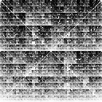
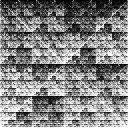

# varKoder convert

The `convert` command can be used to convert **varKodes** to the Chaos Game Representation (CGR). You can find more about CGT in these papers:

1. Jeffrey HJ (1990) Chaos game representation of gene structure. Nucleic Acids Research, 18(8):2163–2170. https://doi.org/10.1093/nar/18.8.2163
2. Arias PM, Alipour F, Hill KA, Kari L (2022) DeLUCS: Deep learning for unsupervised clustering of DNA sequences. PLOS ONE, 17(1):e0261531. https://doi.org/10.1371/journal.pone.0261531

Traditionally, pixels in CGR represent untransformed kmer counts from assembled sequences. Because here we work with raw reads, it is impossible to distinguish a sequence from its reverse complement. In varKoder, both map to the same pixel in an image, in CGR these are duplicated and map to different regions. Therefore CGRs are larger images. In general, CGR tend to show fractal patterns while varKodes cluster similar kmers together, showing smoother gradients.

Additionally, we perform the same data transformation to counts as we do for varKodes (see our paper for more details), so our version of CGR represents ranks of different kmers, not their untransformed count. In prior publications, raw counts are usually employed.

These two images represent the same kmer counts, with individual kmers mapping to different pixels in images for the different representations:

| representation | Beetle | Bacteria | Mushroom |
| ----- | ----- |  ----- | ----- |
| varKode |  |  |    |  
| CGR |  |  |    | 


## Arguments

### Required arguments
| argument | description |
| --- | --- |
|  kmer_mapping  |         pixel mapping to convert to (`varKode` or `cgr`). |
|  input  |                path to folder with image files to be converted. |
|  outdir  |               path to the folder where results will be saved. | 
### Optional arguments
| argument | description |
| --- | --- |
| `-h`, `--help` | show help message and exit. |
| `-d SEED`, `--seed SEED` |  optional random seed. Not relevant for the convert command. |
| `-x` `--overwrite` | overwrite results. | 
| `-vv`, `--version` |  shows varKoder version. |
| `-n N_THREADS`, `--n-threads N_THREADS` | number of threads to process simages in parallel. (default: 1) |
| `-k KMER_SIZE`, `--kmer-size KMER_SIZE` | size of kmers used to produce original images. Will be inferred from file names if omitted. (default: 7) |
| `-p {varKode,cgr} `, `--input-mapping {varKode,cgr}` | kmer mapping of input images. Will be inferred from file names if omitted. |

## Input

There are 3 required inputs:
1. The pixel mapping you want to convert to (`varKode` or `cgr`)
2. A folder with input images. It may contain subfolders.
3. An output folder

The kmer length used to produce images and the original pixel mapping will try to be inferred from image file names. If your images do not have the conventional names used by varKoder, you will have to provide those as optional arguments.


## Output

A new remapped image will be saved for each input image inside the output directory. If there were subdirectories in the input, these will be preserved in the output. If the input images have been generated using `varKoder image`, the image metadata will also be preserved (e. g. labels).

## Example

To create a chaos game representation from varKodes created with kmer size of 7 in folder `varKodes_folder` and save them to `cgr_folder`:

```bash
varKoder convert cgr varKodes_folder cgr_folder
```


