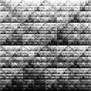

# varKoder convert

The `convert` command can be used to convert **varKodes** to the Chaos Game Representation (CGR). You can find more about CGR in these papers:

1. Jeffrey HJ (1990) Chaos game representation of gene structure. Nucleic Acids Research, 18(8):2163–2170. https://doi.org/10.1093/nar/18.8.2163
2. Arias PM, Alipour F, Hill KA, Kari L (2022) DeLUCS: Deep learning for unsupervised clustering of DNA sequences. PLOS ONE, 17(1):e0261531. https://doi.org/10.1371/journal.pone.0261531

in prior usage, pixels in CGR represent linearly rescaled kmer counts from assembled sequences. Because here we work with raw reads, it is impossible to distinguish a sequence from its reverse complement. In varKodes, we only include the canonical sequence (i. e. a given pixel sums the counts for a k-mer and its reverse complement). In CGR, both k-mers are represented as separated pixels. 

In our flavor of CGR, which we call ranked frequency Chaos Game Representation (rfCGR), we have two changes:
1. We use canonical k-mers, so frequency for a k-mer and its reverse complement are summed up together. Both are represented in the image, with the same brightness.
2. We transform the data so that pixel brightness corresponds to the rank order of k-mer frequencies, the same transformation we use for varKodes (see our paper for more details). 

These two images represent the same kmer counts, with individual kmers mapping to different pixels in images for the different representations:

| representation | Beetle | Bacteria | Mushroom |
| ----- | ----- |  ----- | ----- |
| varKode |  |  |    |  
| rfCGR |  |  |    | 


## Arguments

### Required arguments
| argument | description |
| --- | --- |
|  kmer_mapping  |         pixel mapping to convert to (`varKode` or `cgr`). |
|  input  |                path to folder with image files to be converted. |
|  outdir  |               path to the folder where results will be saved. | 
### Optional arguments
| argument | description |
| --- | --- |
| `-h`, `--help` | show help message and exit. |
| `-d SEED`, `--seed SEED` |  optional random seed. Not relevant for the convert command. |
| `-x` `--overwrite` | overwrite results. | 
| `-vv`, `--version` |  shows varKoder version. |
| `-n N_THREADS`, `--n-threads N_THREADS` | number of threads to process images in parallel. (default: 1) |
| `-k KMER_SIZE`, `--kmer-size KMER_SIZE` | size of kmers used to produce original images. Will be inferred from file names if omitted. (default: 7) |
| `-p {varKode,cgr} `, `--input-mapping {varKode,cgr}` | kmer mapping of input images. Will be inferred from file names if omitted. |
| `-r`, `--sum-reverse-complements` | When converting from CGR to varKode, add together counts from canonical kmers and their reverse complements. |

## Input

There are 3 required inputs:
1. The pixel mapping you want to convert to (`varKode` or `cgr`)
2. A folder with input images. It may contain subfolders.
3. An output folder

The kmer length used to produce images and the original pixel mapping will try to be inferred from image file names. If your images do not have the conventional names used by varKoder, you will have to provide those as optional arguments.


## Output

A new remapped image will be saved for each input image inside the output directory. If there were subdirectories in the input, these will be preserved in the output. If the input images have been generated using `varKoder image`, the image metadata will also be preserved (e. g. labels).

## Example

To create a chaos game representation from varKodes created with kmer size of 7 in folder `varKodes_folder` and save them to `cgr_folder`:

```bash
varKoder convert cgr varKodes_folder cgr_folder
```

## Examples

Here are several examples demonstrating how to use the `convert` command in different scenarios:

### Example 1: Converting varKodes to CGR Representation

Convert a folder of varKodes to Chaos Game Representation:

```bash
varKoder convert cgr path/to/varkodes cgr_output
```

This converts all varKode images in the input folder to the Chaos Game Representation format, preserving their metadata.

### Example 2: Converting CGR Images to varKode Representation

Convert Chaos Game Representation images to varKode format:

```bash
varKoder convert varKode path/to/cgr_images varkode_output
```

This converts all CGR images in the input folder to the varKode format.

### Example 3: Converting Images with Specific K-mer Size

Explicitly specify the k-mer size when converting images:

```bash
varKoder convert cgr path/to/varkodes cgr_k9_output --kmer-size 9
```

This is useful when the k-mer size cannot be inferred from the filenames or when you want to ensure a specific k-mer size is used.

### Example 4: Parallel Processing for Large Image Sets

Convert a large set of images using parallel processing:

```bash
varKoder convert varKode path/to/cgr_images varkode_parallel_output --n-threads 8
```

This uses 8 parallel threads to speed up the conversion process when dealing with a large number of images.

### Example 5: Converting with Explicit Input Mapping and Reverse Complement Handling

Convert images with explicitly specified input mapping and handling of reverse complements:

```bash
varKoder convert varKode path/to/cgr_images special_varkode_output --input-mapping cgr --sum-reverse-complements
```

This explicitly states that the input images are in CGR format and instructs the converter to sum the counts from canonical k-mers and their reverse complements when creating the varKode images.

